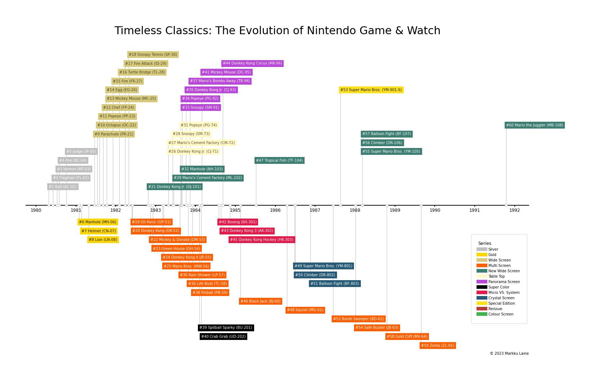

# Nintendo Game & Watch: Data Visualizations

The goal of this project is to explore the Nintendo Game & Watch dataset through visualizations. These visualizations provide an easy and intuitive way for retro game collectors to gain insights and a deeper understanding of the evolution and impact of Nintendo Game & Watch over time.


## Project File Structure

The main files and folders of this project are:

```
.
├── data                   : Datasets
├── figures                : Generated visualizations
├── nintendo_gw_viz.ipynb  : Jupyter notebook file
└── utils.py               : Utility functions
```


## Installation

### Prerequisites

* [Python 3.9+](https://www.python.org/)

### Virtual Environment

Install [Miniconda](https://docs.conda.io/en/latest/miniconda.html), after which we can create a dedicated Python virtual environment for the project:

```bash
# Create a virtual environment for Python 3.9
conda create -n nintendo-gw-viz python=3.9

# Activate the environment
conda activate nintendo-gw-viz

# Deactivate the environment, if needed
conda deactivate
```

### Python Dependencies

Install Python dependencies, including those needed for development:

```bash
pip install -r requirements-dev.txt
```

> **Note:** Make sure the Python virtual environment is active before installing requirements.


## Usage

Open the Jupyter noteobook:

```bash
jupyter notebook nintendo_gw_viz.ipynb
```


## Utility tools

This project comes with [pre-commit](https://pypi.org/project/pre-commit/) hooks that include several utility tools to ensure a consistent and high-quality coding style. To install and use (or uninstall) `pre-commit`, run:

```bash
# Install pre-commit into your git hooks
pre-commit install --install-hooks --overwrite

# Run all pre-commit hooks against all tracked files
pre-commit run -a

# Run all pre-commit hooks against all files
pre-commit run --files **/*.py

# Uninstall pre-commit from your git hooks, if needed
pre-commit uninstall
```


## License

Copyright (c) 2023 [Markku Laine](https://markkulaine.com)

This software is distributed under the terms of the [MIT License](https://opensource.org/license/mit/). See [LICENSE](./LICENSE) for details.
